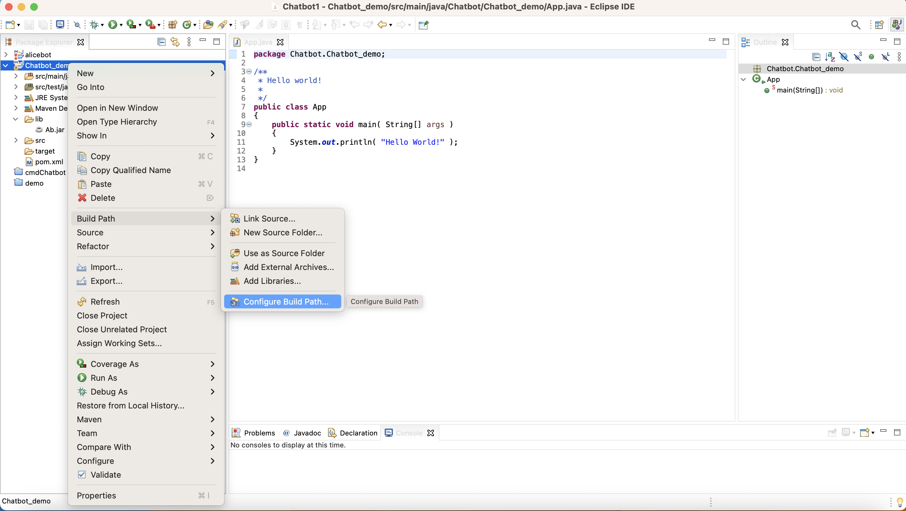
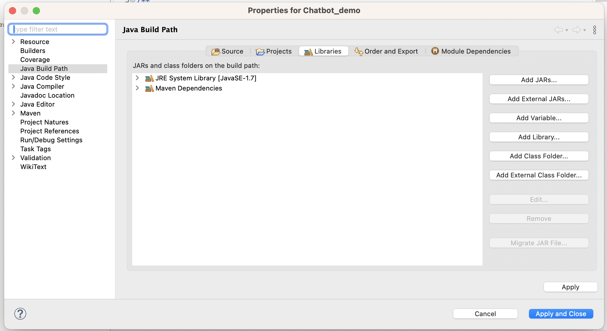
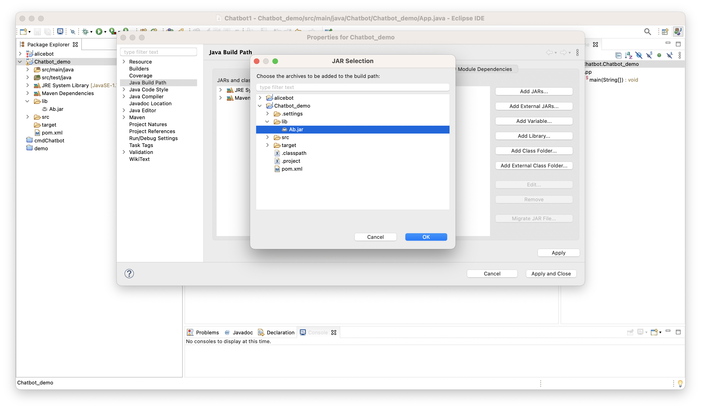
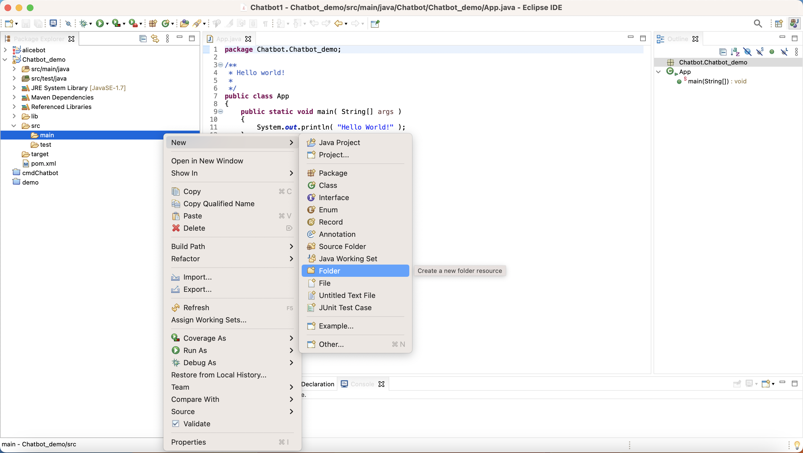
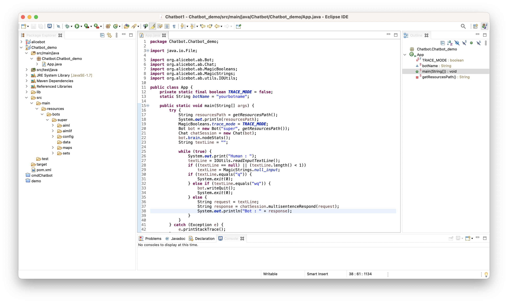

## Task-9: Add AIML to your Project
### Enable .jar in your Project
1. Begin by downloading the "lib" folder from the provided repository.
2. Copy the downloaded "lib" folder into the root directory of your Maven project.
3. Right-click on your project and select "Build Path."
4. Choose "Configure Build Path" from the menu.
   
5. In the "Libraries" tab, click on "Add JARs..."
   
6. Navigate to the "lib" folder and select "Ab.jar," then click "OK."
   
7. Apply the changes and close the build path configuration.

### Adding AIML files
1. Navigate to the "src" folder in your project, where you'll find "main" and "test" folders.
2. Right-click on the "main" folder, hover over "New," and select "Folder."
    
3. Create a new folder named "resources" in the "main" folder.
5. Download the "bots" folder from the provided repository.
6. Copy the downloaded "bots" folder into the "resources" folder of your project.

Your project should look like this:
 
