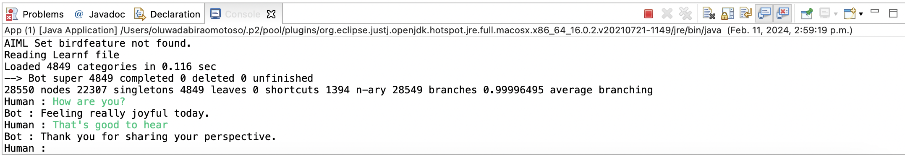

### Task-10: Let's Test!
After completing the integration of AIML and configuring your project, you are now ready to test your Chatbot.
1. Open your "App.java" class.
2. Click the "Run" button to execute your application  .

Now, you can interact with your Chatbot directly in the console!

Feel free to engage in conversations with your Chatbot and explore its responses. 
